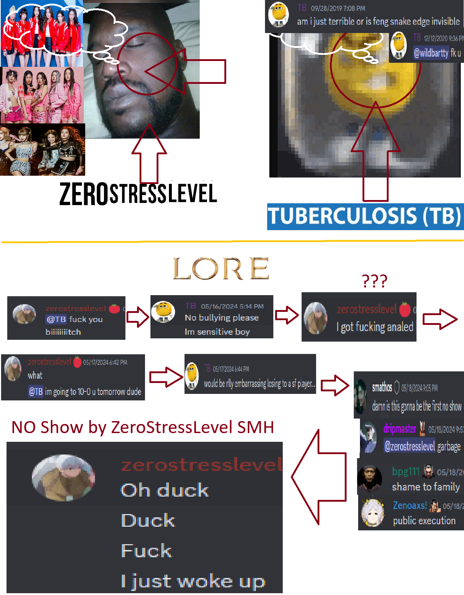
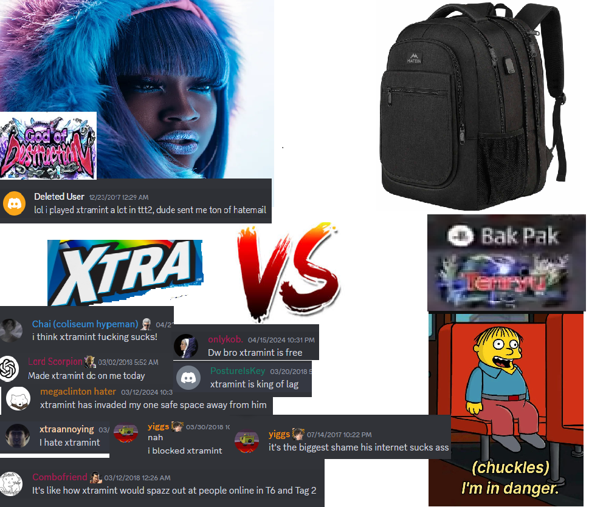
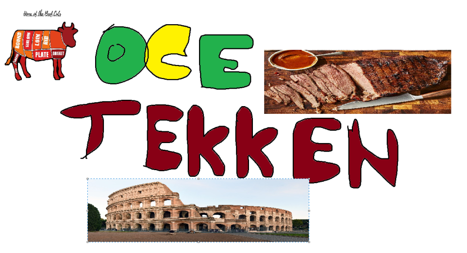

# OCE Coliseum BEEFS

Rule 1 : **No Show** - Must be present in the channel between 2-10 mins before. (If not..)

Rule 2 : **Format** - FT10 and stage change (depends on whoever sets up the lobby)

Rule 3 : **Character Change** - Can change character if they have recently lost a game.

Rule 4 : **Announcing** - Must announce the match at the coliseum channel (in the discord). Both parties must agree to it being a coliseum match.

Links: [OCE Tekken Discord](https://discord.gg/HHs95kTMSn), 
[Official Coliseum Theme Song](https://www.youtube.com/watch?v=pDg6rCHgoHQ)

## Rewards/Punishments

- Loser role for losers
- Winner role for winners
- Winner gets a point on the leaderboard and loser gets a -1 point

## Upcoming Beef

zerostresslevel vs TB (may 23rd, sometimes 7-8pm or something)

Xtramint vs BAK_PAK (not sure when)

- [Previous Beefs](HISTORY.md) 
- [Leaderboard](https://challonge.com/OCEDiscordBEEF)

## STAFF MEMBER / KNOWN ENTITIES ##

- Shing, Ducky, Hangman, Shanni - Mod team
- [LpeX](https://www.twitch.tv/mrlpex) - Admin/Sometimes Streamer
- [Chai](https://www.twitch.tv/chai) - Streamer/Hypeman
- Dangerous_Ace - Court Artiste
- xtramint - Beefmaster
- zerostresslevel - Village Tomato
- db2 - Spectator

## Banner ##

